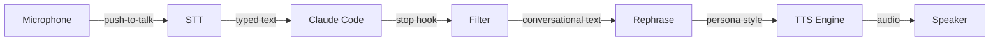

# Claudible

This is just a fun little project that I thought I would open up. I'm still doing some testing, tuning, and updates, but it's quite useful. You have OpenClaw or Claude Remote Control while you are away, but when I'm at my desk I am surrounded by an army of assistants, and Claudible makes me feel a bit like Iron Man, or a manic air traffic controller. At any time I have 3-4 machines running. While I'm really focused on one or another task I keep the other ones going with Claudible. They tell me when they are done and read the relevant information back to me if there is a question or if I need to give them a new task. For fun, I give them different voices and it's easy to add your own voice or others from voice samples.

Personally I'm a huge Dungeon Crawler Carl fan and I use the System AI voice to yell out "New Achievement!" when it completes a big task for me usually with some snarky comment. It does refuse to do work unless I upload a picture of my feet occasionally. I'll have to look into that.

Not available for Windows just yet. I currently work for Microsoft so I should have access to one somewhere around here. :)

Good Luck, Have Fun, Dont Die!

Voice interface for [Claude Code](https://docs.anthropic.com/en/docs/claude-code) — (or anything really) hear Claude speak with cloned voices, talk back with push-to-talk, and add personality with AI rephrasing.

Everything runs locally. No cloud APIs, no data leaving your machine.

## Features

- **Text-to-Speech** — Coqui XTTS v2 running locally on your GPU with voice cloning
- **Speech-to-Text** — Push-to-talk via nerd-dictation (VOSK), types directly into your terminal
- **Personality Rephrasing** — Optional LLM pass that rephrases Claude's output before speaking (any OpenAI-compatible API)
- **Smart Filtering** — Only speaks conversational text, skips code blocks and command output
- **Claude Code Integration** — Stop hook automatically speaks every response
- **Voice Management** — Clone from audio files, record your own, or combine short clips
- **12 Built-in Personas** — From a NASA mission controller to a film noir detective
- **Custom Personas** — Create and manage personas with trigger words from the config UI
- **Browser Config UI** — Full settings dashboard at `localhost:5959/config`
- **Noise Suppression** — RNNoise background noise removal via PipeWire (installable from the UI)
- **System Tray** — Tray icon with STT/TTS toggles and server status
- **Systemd Daemon** — Runs on login as a user service

## How It Works



When Claude finishes a response, the stop hook fires. The filter strips code blocks, command output, file paths, and technical noise. The rephraser (optional) transforms the text through a persona. The TTS engine speaks it using your chosen voice.

For input, hold Right Ctrl to talk — your speech is transcribed and typed into the terminal.

## Requirements

- Linux (Ubuntu/Debian-based)
- NVIDIA GPU with 4+ GB VRAM
- [uv](https://docs.astral.sh/uv/) (recommended) or pip
- [Ollama](https://ollama.ai) or any OpenAI-compatible API (optional, for rephrasing)

## Install

```bash
# Install uv if needed
curl -LsSf https://astral.sh/uv/install.sh | sh

# Clone and install
git clone https://github.com/JayTitus/claudible.git
uv tool install ./claudible --python 3.11

# Run the setup wizard (installs all dependencies, configures everything, starts daemon)
claudible install
```

The setup wizard handles everything: system packages, Python dependencies, VOSK speech model, nerd-dictation, RNNoise noise suppression, Claude Code hook, and the systemd daemon. It will prompt for sudo when needed for system packages.

## Quick Start

After `claudible install` completes, the daemon is already running. Open the config UI:

```bash
claudible config
```

This opens `http://localhost:5959/config` in your browser.

To test speech manually:

```bash
claudible speak "Hello, I am claudible."
```

## Config UI

The browser-based config UI at `localhost:5959/config` is the primary way to manage claudible. It has six tabs:


**Dashboard** — Server status, hook status, voice count, rephrase status, input group, and RNNoise status at a glance. Shows a banner with install commands if any system dependencies are missing.

**Voice** — Select active voice, test voices, adjust speed and language. Shows voice sample details (duration, sample rate, file size).

**Rephrase** — Enable/disable rephrasing, configure the API endpoint (Ollama, Open WebUI, or any OpenAI-compatible API), select model, choose persona. Includes a test rephrase panel to preview output.

**Personas** — Browse all 12 built-in personas and any custom ones. Create new personas with a name, trigger word, trigger mode (always-listening or PTT-only), and system prompt. Edit or delete custom personas inline.

**STT** — Configure push-to-talk key, toggle key, hold mode, VOSK model, and nerd-dictation path. Manage voice keywords (spoken words that map to keystrokes, e.g. "submit" presses Enter). Install and toggle RNNoise noise suppression directly from the UI.

**Logs** — View daemon logs (journalctl output) in a scrollable viewer.

## Personas

Claudible ships with 12 built-in personas that rephrase Claude's output before speaking:

| Persona | Style |
|---------|-------|
| **default** | Natural, conversational |
| **jarvis** | Dry, witty, British AI assistant |
| **casual** | Colleague over coffee |
| **terse** | Telegram-style, stripped to essentials |
| **mission-control** | Apollo-era NASA operator — "All systems nominal" |
| **noir** | 1940s hard-boiled detective — "This case was getting ugly" |
| **butler** | Victorian butler — "Very good, sir" |
| **pirate** | Pirate captain — "Smooth sailing, matey" |
| **drill-sergeant** | Military instructor — "Listen up, recruit!" |
| **announcer** | 1930s radio broadcaster — "Ladies and gentlemen..." |
| **oracle** | Wise, calm, pattern-and-flow |
| **engineer** | Scottish chief engineer — "She cannae take any more!" |

Personas can be managed entirely from the **Personas** tab in the config UI. Each persona can have a **trigger word** (for future wake-word detection) and a **trigger mode** (always-listening or PTT-only).

Custom personas are stored at `~/.config/claudible/personas/*.txt`.

## Voices

Voices are stored at `~/.local/share/claudible/voices/`. Each voice is a directory containing a `.wav` reference file. Select and test voices from the **Voice** tab in the config UI.

To add voices from the command line:

```bash
# Add a voice from a WAV file (validates and resamples to 22050 Hz mono)
claudible voices add myvoice /path/to/sample.wav

# Record a voice from your microphone
claudible voices record myvoice

# Combine multiple short clips into one XTTS-ready sample
claudible voices combine hal clip1.wav clip2.mp3 clip3.wav
```

For best results, use 6-15 seconds of clean speech audio at 22050 Hz.

## Daemon Management

The setup wizard installs and starts the daemon automatically. For manual control:

```bash
claudible daemon start      # Start the service
claudible daemon stop       # Stop the service
claudible daemon status     # Show service status
claudible daemon logs       # Follow service logs (Ctrl+C to stop)
claudible daemon install    # Reinstall service file (e.g. after cuDNN changes)
```

## Building from Source

```bash
git clone https://github.com/JayTitus/claudible.git
cd claudible

uv venv --python 3.11
uv pip install -e ".[dev]"

uv run pytest tests/
uv run ruff check src/
```

## Troubleshooting

**Config UI not loading / 404**
The TTS server must be running. If you updated claudible, restart the daemon — an old server process may still be running with the previous code:
```bash
claudible daemon stop && claudible daemon start
```

**cuDNN not found / CUDA errors under systemd**
Re-run `claudible daemon install` — it auto-detects the cuDNN library path.

**"Permission denied" on keybinds**
`claudible install` handles this, but if needed: `sudo usermod -aG input $USER`, then log out and back in.

**`transformers` version error**
Coqui TTS 0.22 requires `transformers<4.45`. Re-run `claudible install` to auto-fix.

**RNNoise build fails**
Ensure cmake and build-essential are installed: `sudo apt install cmake build-essential`. Then use the Install button in the STT tab, or re-run `claudible install`.

**Server not starting**
Check logs with `claudible daemon logs` or run `claudible server` interactively.

## License

MIT
