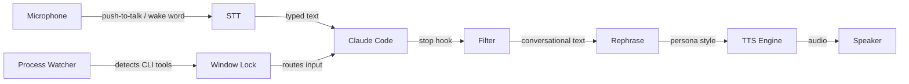
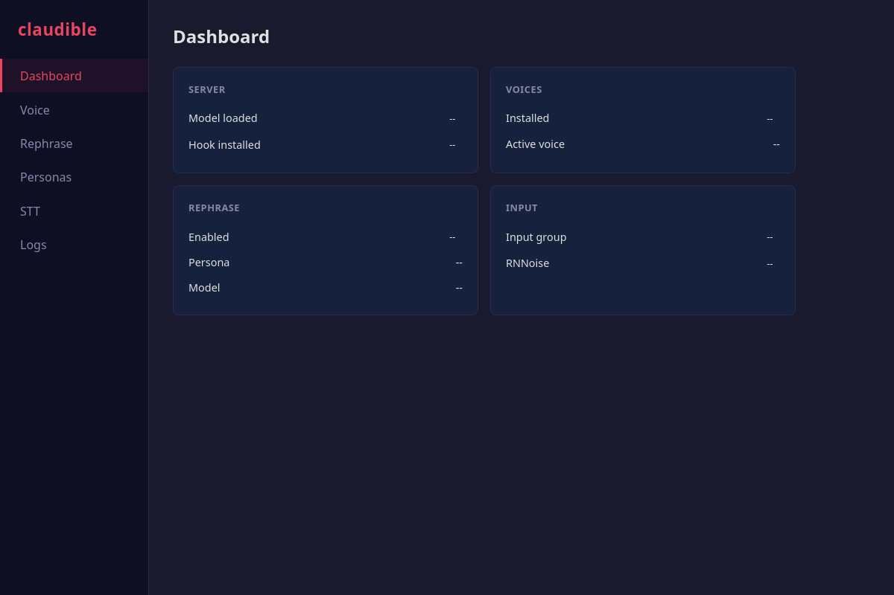

# Claudible

This is just a fun little project that I thought I would open up. I'm still doing some testing, tuning, and updates, but it's quite useful. You have OpenClaw or Claude Remote Control while you are away, but when I'm at my desk I am surrounded by an army of assistants, and Claudible makes me feel a bit like Iron Man, or a manic air traffic controller. At any time I have 3-4 machines running. While I'm really focused on one or another task I keep the other ones going with Claudible. They tell me when they are done and read the relevant information back to me if there is a question or if I need to give them a new task. For fun, I give them different voices and it's easy to add your own voice or others from voice samples.

Personally I'm a huge Dungeon Crawler Carl fan and I use the System AI voice to yell out "New Achievement!" when it completes a big task for me usually with some snarky comment. It does refuse to do work unless I upload a picture of my feet occasionally. I'll have to look into that.

Not available for Windows just yet. I currently work for Microsoft so I should have access to one somewhere around here. :)

Good Luck, Have Fun, Dont Die!

Voice interface for [Claude Code](https://docs.anthropic.com/en/docs/claude-code) — (or anything really) hear Claude speak with cloned voices, talk back with push-to-talk, and add personality with AI rephrasing.

Everything runs locally. No cloud APIs, no data leaving your machine.

## Features

- **Text-to-Speech** — Coqui XTTS v2 running locally on your GPU with voice cloning
- **Speech-to-Text** — Push-to-talk and always-listening, types directly into your terminal. Two backends:
  - **Whisper** (default for new installs) — faster-whisper streaming with Silero VAD pre-filter. Far better accuracy for technical vocabulary, names, and punctuation. Whisper-class noise rejection — vibrations and keyboard taps don't trigger false transcriptions.
  - **nerd-dictation** (legacy) — VOSK-based, lighter on the GPU, no model download.
- **Wake Word Detection** — Say a trigger word (e.g. "Jarvis") to activate, auto-sleeps after idle timeout
- **Process-Based Window Lock** — Automatically detects CLI tools (Claude, Codex, Gemini) running in terminal windows and routes voice input to the correct one
- **Auto STT Toggle** — Listening starts automatically when a watched process appears and stops when the last one exits
- **Personality Rephrasing** — Optional LLM pass that rephrases Claude's output before speaking (any OpenAI-compatible API)
- **Smart Filtering** — Only speaks conversational text, skips code blocks and command output
- **Claude Code Integration** — Stop hook automatically speaks every response
- **Voice Management** — Clone from audio files, record your own, or combine short clips
- **12 Built-in Personas** — From a NASA mission controller to a film noir detective
- **Custom Personas** — Create and manage personas with trigger words from the config UI
- **Browser Config UI** — Full settings dashboard at `localhost:5959/config`
- **Noise Suppression** — RNNoise background noise removal via PipeWire (installable from the UI)
- **System Tray** — Tray icon with STT/TTS toggles and server status
- **Systemd Daemon** — Runs on login as a user service

## How It Works



When Claude finishes a response, the stop hook fires. The filter strips code blocks, command output, file paths, and technical noise. The rephraser (optional) transforms the text through a persona. The TTS engine speaks it using your chosen voice.

For input, hold Right Ctrl to talk (push-to-talk) or press Scroll Lock for always-listening mode. With wake word enabled, say a trigger word like "Jarvis" to activate, speak your command, and say "submit" to send.

## Requirements

- Linux (Ubuntu/Debian-based, X11) — primary target. Experimental macOS support; no Wayland yet.
- NVIDIA GPU recommended:
  - **TTS only** (XTTS v2): 4+ GB VRAM
  - **TTS + Whisper STT** (default): 6+ GB VRAM (XTTS ≈ 3 GB, distil-large-v3 ≈ 1.5 GB, plus headroom)
  - **CPU fallback** for STT works with `whisper.model = "tiny.en"` or `"base.en"` and `device = "cpu"` — slower but no GPU needed for the STT side. TTS still wants a GPU for real-time output.
- ~3 GB free disk for the Whisper model on first run (cached in `~/.cache/huggingface/`)
- [uv](https://docs.astral.sh/uv/) (recommended) or pip
- [Ollama](https://ollama.ai) or any OpenAI-compatible API (optional, for rephrasing and STT correction)

### Choosing a Whisper model

Set in `[whisper]` section of `~/.config/claudible/config.toml` or via the config UI.

| Model | VRAM | Quality | Latency (RTX-class) | Notes |
|---|---|---|---|---|
| `distil-large-v3` *(default)* | ~1.5 GB | Excellent | ~30× realtime | Best quality/VRAM tradeoff |
| `large-v3-turbo` | ~1.5 GB | Excellent | ~40× realtime | Fastest of the high-quality models |
| `large-v3` | ~3 GB | Highest | ~10× realtime | Use if you have VRAM and want max accuracy |
| `base.en` | ~150 MB | Good | CPU-runnable | English-only, decent on CPU |
| `tiny.en` | ~75 MB | Fair | CPU-runnable | English-only, fast on CPU |

## Install

```bash
# Install uv if needed
curl -LsSf https://astral.sh/uv/install.sh | sh

# Clone and install
git clone https://github.com/JayTitus/claudible.git
uv tool install ./claudible --python 3.11

# Run the setup wizard (installs all dependencies, configures everything, starts daemon)
claudible install
```

The setup wizard handles everything: system packages, Python dependencies, VOSK speech model, nerd-dictation, RNNoise noise suppression, Claude Code hook, and the systemd daemon. It will prompt for sudo when needed for system packages.

## Quick Start

After `claudible install` completes, the daemon is already running. Open the config UI:

```bash
claudible config
```

This opens `http://localhost:5959/config` in your browser.

To test speech manually:

```bash
claudible speak "Hello, I am claudible."
```

## Config UI

The browser-based config UI at `localhost:5959/config` is the primary way to manage claudible. It has six tabs:



**Dashboard** — Server status, hook status, voice count, rephrase status, input group, and RNNoise status at a glance. Shows a banner with install commands if any system dependencies are missing.

**Voice** — Select active voice, test voices, adjust speed, language, and audio lead-in. Shows voice sample details (duration, sample rate, file size).

**Rephrase** — Enable/disable rephrasing, configure the API endpoint (Ollama, Open WebUI, or any OpenAI-compatible API), select model, choose persona. Includes a test rephrase panel to preview output.

**Personas** — Browse all 12 built-in personas and any custom ones. Create new personas with a name, trigger word, trigger mode (always-listening or PTT-only), and system prompt. Edit or delete custom personas inline.

**STT** — Configure push-to-talk key, toggle key, hold mode, VOSK model, and nerd-dictation path. Manage voice keywords (spoken words that map to keystrokes, e.g. "submit" presses Enter). Install and toggle RNNoise noise suppression. Configure window lock watched processes and poll interval.

**Logs** — View daemon logs (journalctl output) in a scrollable viewer.

## Speech-to-Text Configuration

### Step 1: Basic STT Setup

After running `claudible install`, STT is configured with sensible defaults:

- **Push-to-talk key**: Right Ctrl (hold to talk)
- **Toggle key**: Scroll Lock (press to toggle always-listening mode)
- **VOSK model**: `small` (fast, lower accuracy — switch to `large` for better recognition)

Download a larger VOSK model for better accuracy:
```bash
mkdir -p ~/.local/share/vosk
cd ~/.local/share/vosk
wget https://alphacephei.com/vosk/models/vosk-model-en-us-0.22.zip
unzip vosk-model-en-us-0.22.zip
mv vosk-model-en-us-0.22 large
```

Then set `vosk_model = "large"` in the STT tab of the config UI.

### Step 2: Wake Word (Optional)

Wake word lets you keep always-listening mode on without typing random noise. Speech is only processed after you say a trigger word.

1. Open the config UI (`claudible config`)
2. Go to the **STT** tab
3. Enable **Wake Word**
4. Set the idle timeout (default: 15 seconds — resets on each spoken phrase)
5. Go to the **Personas** tab and set trigger words for your personas (e.g. "Jarvis" for default, "System" for a custom persona)

How it works:
- **Orange tray icon** — listening for wake word
- Say **"Jarvis"** (or your trigger word) — icon turns **green**, speech is captured
- Dictate your command — text is typed into the target terminal
- Say **"submit"** — sends Enter and returns to wake word listening (orange)
- If you stop talking for the idle timeout (default 15s), it auto-returns to wake word listening

Slot routing with wake words: say "Jarvis two" to target slot 2 (second terminal).

### Step 3: Window Lock / Process Watcher

The process watcher automatically detects CLI tools running in **standalone terminal emulators** (Konsole, Alacritty, GNOME Terminal, etc.) and routes voice input to the correct terminal window.

1. Open the config UI, go to the **STT** tab
2. **Window Lock** should be enabled by default
3. Configure **Watched Processes** (default: `claude, codex, gemini`)
4. Set the **Poll Interval** (default: 2 seconds)

How it works:
- The daemon polls `/proc` for watched process names every 2 seconds
- When a match is found in a terminal emulator, it auto-assigns a window slot
- STT automatically starts when the first watched process appears
- STT automatically stops when the last watched process exits
- Multiple terminals get numbered slots (slot 1, slot 2, etc.)

**Supported terminal emulators**: Konsole, Alacritty, Kitty, WezTerm, GNOME Terminal, xterm, xfce4-terminal, Tilix, Terminator, Guake, Yakuake, and others.

**Limitation — IDE integrated terminals are not supported.** VS Code, JetBrains IDEs, and other editors with built-in terminals cannot be targeted by xdotool because the terminal is an internal widget, not a separate X11 window. Voice input sent to an IDE window goes to whatever element has focus (editor, file explorer, etc.), not the terminal pane. Run your CLI tools in a standalone terminal emulator for window lock to work correctly.

### Step 4: Voice Keywords

Voice keywords map spoken words to keystrokes. Defaults:

| Spoken Word | Keystroke |
|-------------|-----------|
| submit | Enter |
| enter | Enter |
| backspace | BackSpace |
| tab | Tab |
| escape | Escape |

Add custom keywords in the **STT** tab of the config UI.

Option selection: say "select 2" or "option three" to type a number and press Enter (useful for Claude Code's numbered options).

## Tray Icon States

| Icon Color | Meaning |
|------------|---------|
| **Gray** | STT inactive |
| **Orange** | Listening for wake word |
| **Green** | Actively capturing speech |
| **Red** | Error |

## Audio Best Practices

Getting clean speech recognition in a real-world environment takes some tuning. Here's what works.

### Headset Recommendations

A **multi-device Bluetooth headset with a hardware switch** is ideal for multi-machine setups. You can pair it to 2-3 machines and flip between them without re-pairing. Look for headsets that support **multipoint Bluetooth** (simultaneous connection to 2+ devices).

For STT quality, a **boom mic headset** dramatically outperforms webcam or desk microphones — the mic is 2-3 cm from your mouth, which gives 20-30 dB better signal-to-noise ratio than a desk mic at arm's length. This alone eliminates most background noise issues.

If you prefer a desk mic, use a **cardioid** (directional) microphone aimed at your mouth with the null (rear rejection) pointed toward noise sources (keyboard, TV, speakers).

### Bluetooth Audio Notes

Bluetooth audio has inherent latency (~150-200ms). If TTS speech is clipped at the start, increase the audio lead-in:

```toml
[tts]
audio_lead_in_ms = 250  # default 150, try 250-300 for Bluetooth
```

For better codec quality, switch from SBC to SBC-XQ if your headset supports it:
```bash
pactl set-card-profile bluez_card.YOUR_DEVICE_ID a2dp-sink-sbc_xq
```

**Important**: Bluetooth headsets in HFP/HSP mode (headset profile with mic) drop to extremely low audio quality (8kHz CVSD). Use the headset mic for STT input but keep audio output on A2DP (high quality) if possible. Some headsets handle this automatically with multipoint; others require manual profile switching.

### Reducing Keyboard and Desk Vibration

Mechanical keyboards transmit vibrations through the desk surface to nearby microphones. These appear as short low-frequency thumps that VOSK often recognizes as "the" or other short words.

**Physical fixes** (most effective):
- **Desk mat** under the keyboard absorbs vibration before it reaches the mic
- **Shock mount** or **isolation pad** under the mic stand decouples it from the desk
- **Boom arm** mounted to the desk edge (separate from the keyboard surface) eliminates the structural path entirely
- A headset mic avoids desk vibration entirely

**Software fixes**:
- Enable **RNNoise** noise suppression in the STT tab (already built into claudible)
- Tune the RNNoise **VAD threshold** higher (70-80%) in your PipeWire filter config to reject more transient noise
- Add a **high-pass filter** at 100-120 Hz to remove low-frequency desk rumble — keyboard impacts are primarily 80-200 Hz

### Background Noise and Open Mic

For always-listening mode in noisy environments (TV, music, other people), noise management becomes critical.

**The noise filtering pipeline** (in order of processing):

1. **Acoustic Echo Cancellation (AEC)** — prevents your own TTS output from being picked up by the mic. PipeWire has a built-in echo cancel module using the WebRTC algorithm:

   Create `~/.config/pipewire/pipewire.conf.d/99-echo-cancel.conf`:
   ```
   context.modules = [
     {
       name = libpipewire-module-echo-cancel
       args = {
         library.name  = aec/libspa-aec-webrtc
         aec.args = {
           webrtc.extended_filter    = true
           webrtc.high_pass_filter   = true
           webrtc.noise_suppression  = true
         }
         source.props = {
           node.name = "echo-cancel-source"
           node.description = "Echo-Cancelled Mic"
         }
       }
     }
   ]
   ```
   Then point nerd-dictation at `echo-cancel-source` as the PulseAudio device. This is the single biggest improvement for setups where TTS plays through speakers (not headphones).

2. **RNNoise** — neural network noise suppression (already supported, toggle in STT tab). Excellent at removing steady-state noise (fans, AC, hum) and moderate at transient noise (clicks, taps).

3. **Noise gate** — silences audio below an amplitude threshold. Stacking a noise gate after RNNoise is effective: RNNoise reduces the noise floor, then the gate handles the residual. The `ZamGate` LADSPA plugin (`zam-plugins` package) works well in a PipeWire filter chain.

**Tips for open mic with background TV/music**:
- Use **wake word mode** — the mic only processes speech after the trigger word, ignoring everything else
- Position the mic as close to your mouth as practical (headset > clip mic > desk mic)
- Point a cardioid mic's null toward the TV/speakers
- If TV audio routes through PipeWire, AEC can subtract it automatically
- VOSK's recognition of background TV speech tends to produce low-confidence single-word results — the wake word requirement naturally filters these out

**How Alexa handles this**: Smart speakers use 7-microphone circular arrays with hardware beamforming to spatially focus on the speaker's direction and null out noise sources. They run AEC to subtract their own speaker output, then neural noise suppression, then Voice Activity Detection (VAD) to gate frames before the speech recognizer. The entire DSP pipeline runs on a custom chip. For a single desktop mic, we can't do beamforming, but AEC + RNNoise + wake word gets surprisingly close.

### Recommended Audio Chain

For the best experience, stack these in order:

```
Microphone
  → PipeWire Echo Cancel (AEC — subtract TTS output)
  → RNNoise filter-chain (neural noise suppression)
  → nerd-dictation (VOSK speech recognition)
  → claudible callback (wake word gate → window routing)
```

For headset users, AEC is less critical (your mic doesn't pick up speaker output), but RNNoise still helps with ambient noise.

## Personas

Claudible ships with 12 built-in personas that rephrase Claude's output before speaking:

| Persona | Style |
|---------|-------|
| **default** | Natural, conversational |
| **jarvis** | Dry, witty, British AI assistant |
| **casual** | Colleague over coffee |
| **terse** | Telegram-style, stripped to essentials |
| **mission-control** | Apollo-era NASA operator — "All systems nominal" |
| **noir** | 1940s hard-boiled detective — "This case was getting ugly" |
| **butler** | Victorian butler — "Very good, sir" |
| **pirate** | Pirate captain — "Smooth sailing, matey" |
| **drill-sergeant** | Military instructor — "Listen up, recruit!" |
| **announcer** | 1930s radio broadcaster — "Ladies and gentlemen..." |
| **oracle** | Wise, calm, pattern-and-flow |
| **engineer** | Scottish chief engineer — "She cannae take any more!" |

Personas can be managed entirely from the **Personas** tab in the config UI. Each persona can have a **trigger word** (for wake-word detection) and a **trigger mode** (always-listening or PTT-only).

Custom personas are stored at `~/.config/claudible/personas/*.txt`.

## Voices

Voices are stored at `~/.local/share/claudible/voices/`. Each voice is a directory containing a `.wav` reference file. Select and test voices from the **Voice** tab in the config UI.

To add voices from the command line:

```bash
# Add a voice from a WAV file (validates and resamples to 22050 Hz mono)
claudible voices add myvoice /path/to/sample.wav

# Record a voice from your microphone
claudible voices record myvoice

# Combine multiple short clips into one XTTS-ready sample
claudible voices combine hal clip1.wav clip2.mp3 clip3.wav
```

For best results, use 6-15 seconds of clean speech audio at 22050 Hz.

## Lifecycle Management

Claudible uses PID-based singleton enforcement — only one instance runs at a time.

```bash
claudible start             # Start TTS server + tray icon
claudible stop              # Stop the running process
claudible restart           # Stop + start
claudible                   # Show status (PID, server health)
```

The setup wizard installs a systemd user service that runs `claudible start` on login.

## Building from Source

```bash
git clone https://github.com/JayTitus/claudible.git
cd claudible

uv venv --python 3.11
uv pip install -e ".[dev]"

uv run pytest tests/
uv run ruff check src/
```

## Troubleshooting

**Config UI not loading / 404**
The TTS server must be running. If you updated claudible, restart — an old server process may still be running with the previous code:
```bash
claudible restart
```

**cuDNN not found / CUDA errors under systemd**
Re-run `claudible install` — it auto-detects the cuDNN library path.

**"Permission denied" on keybinds**
`claudible install` handles this, but if needed: `sudo usermod -aG input $USER`, then log out and back in.

**`transformers` version error**
Coqui TTS 0.22 requires `transformers<4.45`. Re-run `claudible install` to auto-fix.

**RNNoise build fails**
Ensure cmake and build-essential are installed: `sudo apt install cmake build-essential`. Then use the Install button in the STT tab, or re-run `claudible install`.

**Server not starting**
Check logs with `journalctl --user -u claudible -f` or run `claudible start` interactively.

**Audio clipping / first word cut off**
Audio sinks (especially Bluetooth) may need time to wake up from a suspended state. Increase the audio lead-in in the Voice tab of the config UI, or in `config.toml`:
```toml
[tts]
audio_lead_in_ms = 250  # default 150, try 250-300 for Bluetooth
```
Set to `0` for wired headphones/speakers with no startup delay.

**Window lock not detecting my terminal**
The process watcher only supports standalone terminal emulators (Konsole, Alacritty, Kitty, etc.). IDE integrated terminals (VS Code, JetBrains) are not supported — xdotool cannot target internal terminal widgets. Run your CLI tools in a standalone terminal for window lock to work.

**STT not typing into the right window**
Check `claudible windows list` to see current slot assignments. If the wrong window is assigned, clear with `claudible windows clear` and restart. The watcher picks the largest window owned by a terminal emulator process.

**Wake word not returning to sleep**
The idle timeout (default 15s) resets on every spoken phrase. If you stop talking entirely, the tray health loop enforces the timeout within ~5 seconds. If the icon stays green, check that `wakeword_timeout` is set in your config.

**Stale install after code changes**
When reinstalling from source, clear the uv cache first:
```bash
uv cache clean claudible
uv tool install . --python 3.11 --force
claudible restart
```

**Bluetooth audio choppy**
Try switching to a higher-quality codec:
```bash
# List available profiles
pactl list cards | grep -A5 bluez

# Switch to SBC-XQ (better quality than default SBC)
pactl set-card-profile bluez_card.YOUR_DEVICE_ID a2dp-sink-sbc_xq
```
Also increase `audio_lead_in_ms` to 250-300 in the Voice config tab.

## License

MIT
