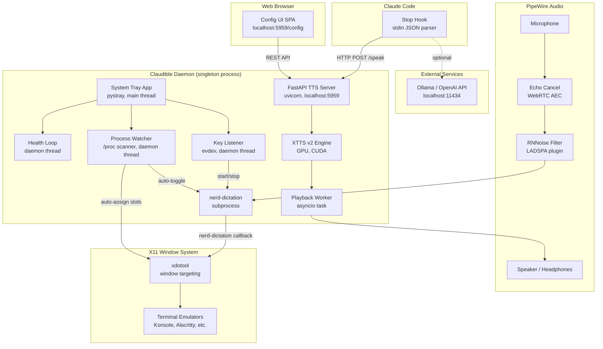
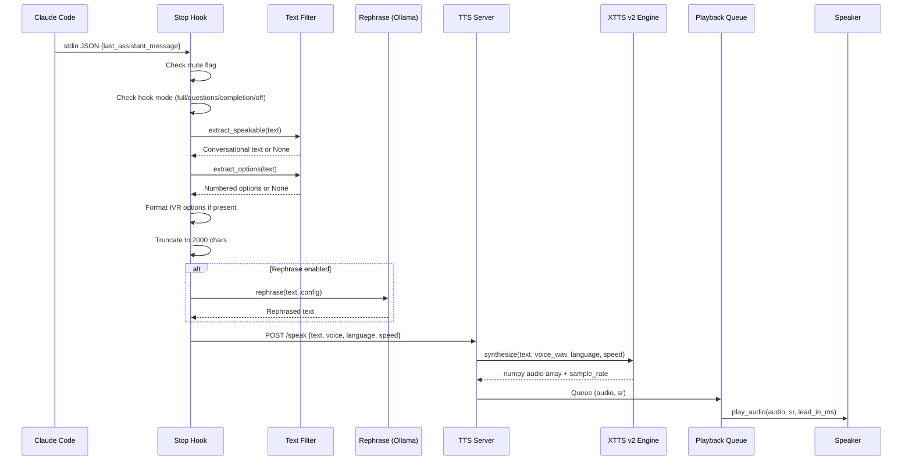
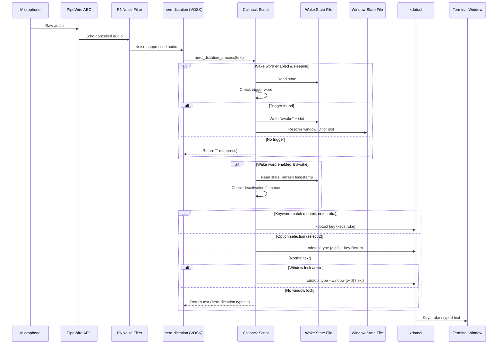
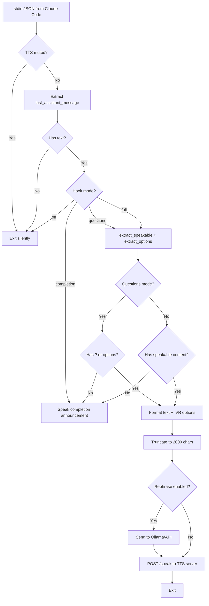
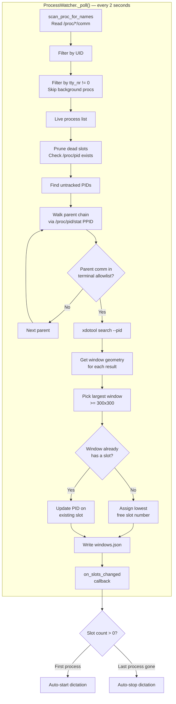
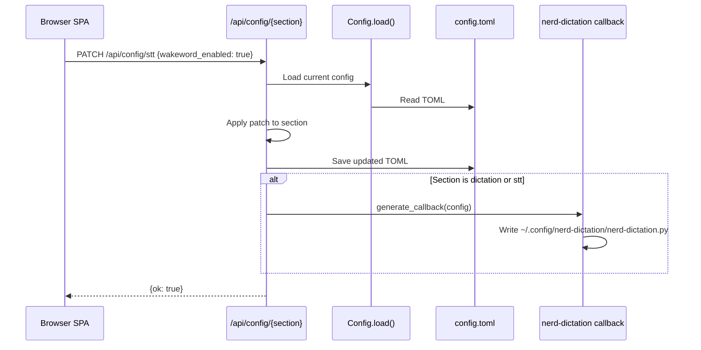
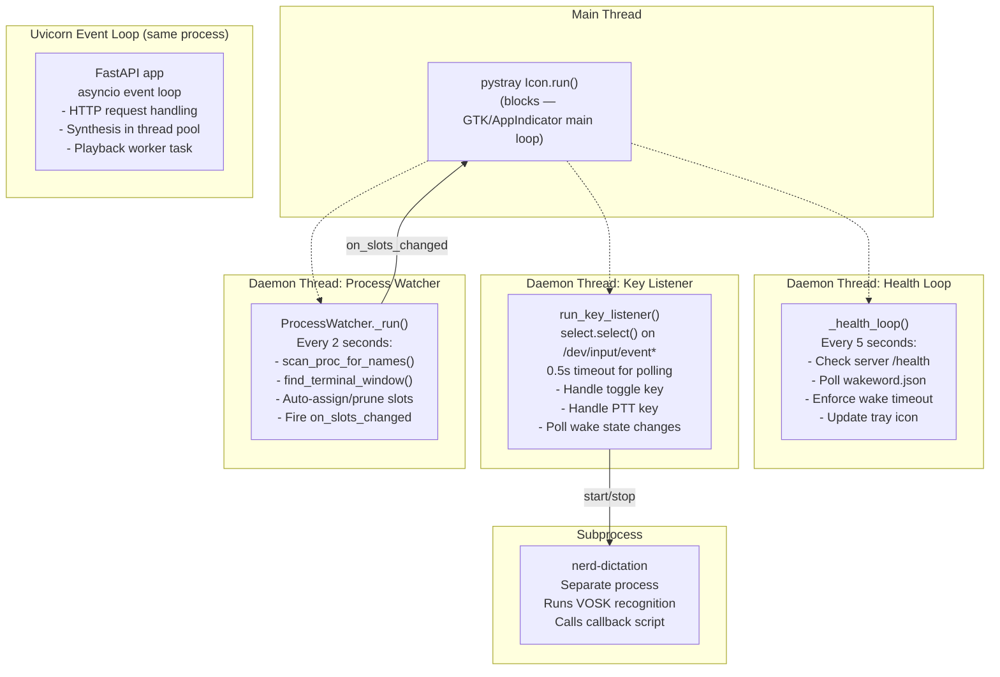

# Claudible Architecture

Comprehensive architecture reference for Claudible, a local voice interface for Claude Code and other CLI tools.

## Table of Contents

1. [System Overview](#system-overview)
2. [Component Descriptions](#component-descriptions)
3. [Data Flow Diagrams](#data-flow-diagrams)
4. [Audio Pipeline](#audio-pipeline)
5. [Process Watcher Architecture](#process-watcher-architecture)
6. [Configuration System](#configuration-system)
7. [File Layout and Key Paths](#file-layout-and-key-paths)
8. [Inter-Component Communication](#inter-component-communication)
9. [Threading Model](#threading-model)
10. [Security Considerations](#security-considerations)
11. [Known Limitations](#known-limitations)
12. [Dependencies and System Requirements](#dependencies-and-system-requirements)

---

## System Overview

Claudible is a locally-running voice interface that adds speech input and output to CLI tools like Claude Code, Codex, and Gemini. It runs as a persistent daemon consisting of a FastAPI TTS server, a system tray application, a key listener for push-to-talk and toggle modes, a process watcher for automatic window targeting, and a Claude Code stop hook that intercepts assistant responses.

Everything runs on the local machine. No cloud APIs are used for TTS or STT. The optional rephrase step uses a local Ollama instance or any OpenAI-compatible API.



### High-Level Process Model

The system consists of two independently-running processes:

1. **Claudible Daemon** -- Started via `claudible start` or systemd. Runs the FastAPI server (port 5959), the tray icon, key listener, process watcher, and manages the nerd-dictation subprocess. Enforced as a singleton via PID file.

2. **Claude Code Stop Hook** -- A short-lived Python script invoked by Claude Code after each assistant response. Reads JSON from stdin, filters and optionally rephrases the text, then sends an HTTP POST to the daemon's `/speak` endpoint. Exits immediately after the request.

---

## Component Descriptions

### TTS Engine (`tts/engine.py`)

Wraps Coqui XTTS v2, a multilingual text-to-speech model that supports voice cloning from short audio samples. The model runs on the GPU via CUDA. Key details:

- Model: `tts_models/multilingual/multi-dataset/xtts_v2`
- Loads once at server startup and persists in GPU memory
- Synthesis is performed in a thread pool (`asyncio.to_thread`) to avoid blocking the event loop
- Accepts a reference WAV file for voice cloning on each synthesis call
- Patches `torch.load` to use `weights_only=False` for compatibility with PyTorch >= 2.6

### TTS Server (`tts/server.py`)

A FastAPI application served by uvicorn on `127.0.0.1:5959`. Responsibilities:

- **`POST /speak`** -- Accepts text, voice, language, and speed. Synthesizes audio via the engine in a thread, then queues it for sequential playback.
- **`GET /health`** -- Returns server and model status.
- **`GET /voices`** -- Lists available voice profiles.
- **`POST /shutdown`** -- Sends SIGTERM to self for graceful shutdown.
- **`GET /config`** -- Serves the web config UI (HTML with cache-busted asset URLs).
- **`/api/*`** -- Mounts the web API router for configuration management.
- **`/static/*`** -- Serves the SPA static assets (HTML, CSS, JS).

The server uses an asyncio `Queue` for playback. A background `_playback_worker` task dequeues audio arrays and plays them sequentially via `sounddevice`, ensuring responses never overlap.

### TTS Audio Playback (`tts/audio.py`)

Simple playback module using `sounddevice` and `soundfile`:

- `play_audio(audio, sample_rate, lead_in_ms)` -- Prepends configurable silence (default 150ms) to let Bluetooth audio sinks wake up before real content starts. Plays synchronously via `sd.play()` + `sd.wait()`.
- `play_file(path)` -- Convenience wrapper for playing WAV files.

### STT Pipeline (`stt/dictation.py`)

Wraps nerd-dictation as a subprocess. nerd-dictation uses VOSK (an offline speech recognition toolkit) under the hood.

- Starts nerd-dictation in `begin --continuous` mode with the configured VOSK model directory
- Exports the claudible venv's `PYTHONPATH` so the subprocess can find `vosk` regardless of which system Python nerd-dictation uses
- Optionally routes audio through the RNNoise PipeWire virtual source (`effect_output.rnnoise`) when noise suppression is enabled
- Before starting, generates a callback script (`~/.config/nerd-dictation/nerd-dictation.py`) that nerd-dictation auto-loads
- Checks for immediate exit (within 1 second) to detect missing models or config errors

### STT Callback (`stt/callback.py`)

Generates a standalone Python script that nerd-dictation loads as its text processing callback. This script is regenerated from the current config whenever dictation starts or STT settings change via the web UI.

The callback implements:

- **Wake word gate** -- When enabled, suppresses all text unless a trigger word is detected. Transitions between "sleeping" (orange tray) and "awake" (green tray) states via a JSON state file. Supports multi-word triggers split across recognition chunks via a lookback buffer.
- **Slot routing with wake words** -- "Jarvis two" activates wake word and targets slot 2. Parses number words ("one" through "ten") and digit strings.
- **Window lock** -- Resolves the target window ID from `windows.json` and routes xdotool input to that specific window instead of the focused one.
- **Voice keywords** -- Maps spoken words to X11 keystrokes (e.g., "submit" sends Enter, "backspace" sends BackSpace). Configurable via the dictation config.
- **Option selection** -- "select 2", "option three", "pick five" etc. type the digit and press Enter. Useful for Claude Code's numbered option prompts.
- **Voice registration** -- "register window two" captures the active X11 window and assigns it to slot 2.
- **Deactivation** -- "stop listening", "go to sleep", "never mind" return to sleeping state.

The callback is a self-contained script with no claudible imports at runtime. All configuration (keywords, trigger words, file paths, feature flags) is embedded as Python literals during generation.

### Key Listener (`stt/keybind.py`)

Reads raw keyboard events from `/dev/input/event*` via evdev. Handles two keys simultaneously:

- **Toggle key** (default: Scroll Lock) -- Press to toggle continuous dictation on/off. Starts/stops nerd-dictation and fires `continuous_on`/`continuous_off` callbacks that update the tray icon.
- **PTT key** (default: Right Ctrl) -- Hold to talk, release to stop. Only active when continuous mode is off. PTT bypasses wake word -- forces awake state immediately.

The listener uses `select.select()` with a 0.5-second timeout for polling wake word state changes and honoring the stop event. Handles device disconnection gracefully by refreshing the keyboard device list.

### Process Watcher (`stt/procwatch.py`)

A daemon thread that polls `/proc` every N seconds (default: 2) looking for watched process names (default: `claude`, `codex`, `gemini`).

Key behaviors:

- **`scan_proc_for_names()`** -- Iterates `/proc/[pid]/` directories. For each PID owned by the current UID, reads `/proc/[pid]/comm` and checks against the watched names set. Filters out background processes by checking `tty_nr` from `/proc/[pid]/stat` -- processes without a controlling terminal (tty_nr == 0) are skipped, which filters out VS Code extension backends and similar.
- **`find_terminal_window()`** -- Walks the parent PID chain via `/proc/[pid]/stat` looking for a process whose comm matches the terminal emulator allowlist. When found, uses `xdotool search --pid` to find X11 windows, then picks the largest one (by area) that meets the minimum size threshold (300x300). This correctly selects the main terminal window over helper/utility windows.
- **Terminal emulator allowlist** -- 25+ terminal emulators: Konsole, Alacritty, Kitty, WezTerm, GNOME Terminal, xterm, and many others. IDE integrated terminals are explicitly excluded.
- **Auto-assign slots** -- New processes get the lowest free numeric slot. If a process appears in a terminal that already has a slot (e.g., restarting claude in the same Konsole window), the existing slot is updated with the new PID.
- **Auto-prune** -- Dead PIDs are detected via `/proc/[pid]` existence check and their slots are removed.
- **Auto-toggle STT** -- Fires `on_slots_changed(count)` callback. The tray app uses this to auto-start dictation when the first watched process appears and auto-stop when the last one exits.

### Window Lock (`stt/windows.py`)

Manages window-to-slot registrations in `~/.cache/claudible/windows.json`:

- **`register_window(slot, window_id)`** -- Captures the active X11 window via `xdotool getactivewindow` if no ID given. Stores `{window_id, title}` under the slot key.
- **`validate_window(window_id)`** -- Checks if an X11 window still exists via `xdotool getwindowname`.
- **`read_window_state()` / `write_window_state()`** -- Atomic file I/O via tmp+rename pattern.

### Noise Suppression (`stt/noise.py`)

Manages two PipeWire audio processing modules:

**RNNoise** -- Neural network noise suppression via a LADSPA plugin:
- Builds `librnnoise_ladspa.so` from source (werman/noise-suppression-for-voice) if not installed
- Deploys a PipeWire filter-chain config at `~/.config/pipewire/filter-chain.conf.d/99-claudible-rnnoise.conf`
- Creates a virtual PipeWire source `effect_output.rnnoise` that nerd-dictation uses as its input device
- Configurable VAD threshold, grace period, and retroactive audio inclusion

**Acoustic Echo Cancellation (AEC)** -- PipeWire's built-in WebRTC echo cancel module:
- Deploys config at `~/.config/pipewire/pipewire.conf.d/99-echo-cancel.conf`
- Creates a virtual source `echo-cancel-source` that subtracts TTS speaker output from the mic input
- Uses the WebRTC algorithm with extended filter, high-pass filter, and noise suppression enabled

### Rephrase (`rephrase/ollama.py`)

Transforms Claude's output text through a persona before TTS. Uses any OpenAI-compatible chat completions API:

- **`rephrase(text, config)`** -- Sends the text with the persona's system prompt to the configured API endpoint. Falls back to original text on failure.
- **`generate_completion_quip(config)`** -- Generates a short in-character completion announcement when the filter strips all content (purely technical response).
- **`list_models(config)`** -- Queries `/models` endpoint for the dropdown in the config UI.

Supports Ollama (`localhost:11434/v1`), Open WebUI, or any hosted OpenAI-compatible provider. API key is optional.

### Personas (`rephrase/personas.py`)

12 built-in personas (default, jarvis, casual, terse, mission-control, noir, butler, pirate, drill-sergeant, announcer, oracle, engineer) plus user-created custom personas.

- Built-in prompts are embedded in the Python source
- Custom personas are plain text files at `~/.config/claudible/personas/*.txt`
- Each persona can have a trigger word and trigger mode (always-listening or PTT-only)
- Persona-voice associations map each persona to a preferred voice

### Stop Hook (`hooks/stop_hook.py`)

Entry point for Claude Code's hook system. Invoked as a subprocess after each assistant response:

1. Checks for TTS mute flag (`~/.cache/claudible/tts_muted`) -- exits immediately if present
2. Reads JSON from stdin, extracts `last_assistant_message`
3. Loads config and checks hook mode:
   - **`off`** -- Silent, returns immediately
   - **`completion`** -- Only speaks a completion announcement, never content
   - **`questions`** -- Only speaks if a question mark or numbered options are detected
   - **`full`** -- Speaks all conversational content (default)
4. Runs `extract_speakable()` to filter the text
5. Runs `extract_options()` to detect numbered choices
6. Formats with IVR-style option reading if options are present
7. Truncates to 2000 chars
8. Optionally rephrases through the active persona
9. POSTs to `http://localhost:5959/speak`

All exceptions are caught silently -- hooks must never crash Claude Code.

### Text Filter (`hooks/filter.py`)

Extracts only conversational text from Claude's markdown output:

- **`extract_speakable(text)`** -- Strips code blocks (fenced with triple backticks), command output (lines starting with `$`, `>`, `%`, `>>>`), markdown tables, horizontal rules, standalone file paths, git hashes, CLI commands, inline code spans, config entries, and markdown headers for code sections. Joins surviving lines into a single string. Returns `None` if the result is too short (< 15 chars), has no question mark, or is dominated by technical tokens (> 50% paths/hashes/flags).
- **`extract_options(text)`** -- Detects numbered lists (`1. description` or `1) description`) outside code blocks. Returns the list if 2+ options found. Strips markdown bold and inline code from descriptions.

### Tray App (`gui/tray.py`)

The system tray icon built on pystray with AppIndicator backend (via PyGObject):

- Manages the tray icon lifecycle as the main thread (pystray requires this)
- Shows four icon states: gray (inactive), orange (listening for wake word), green (active), red (error)
- Menu items: server status (read-only), STT toggle, TTS notifications toggle, Open Settings, Quit
- TTS mute is implemented via a flag file (`~/.cache/claudible/tts_muted`) that the stop hook checks

### Lifecycle (`lifecycle.py`)

PID-based singleton enforcement:

- **`write_pid()`** -- Called during server lifespan startup. Writes current PID to `~/.cache/claudible/claudible.pid`.
- **`is_running()`** -- Reads PID file, sends signal 0 to check if alive. Cleans up stale PID files.
- **`stop_running()`** -- Sends SIGTERM and polls for up to 5 seconds. Returns whether a process was stopped.

### Web Config UI (`web/router.py` + `web/static/`)

A browser-based SPA served at `localhost:5959/config` with six tabs (Dashboard, Voice, Rephrase, Personas, STT, Logs). The API router at `/api` provides:

- **Config CRUD** -- `GET /api/config`, `PATCH /api/config/{section}` for per-section updates
- **Status** -- `GET /api/status` returns model state, hook status, voice count, input group membership, RNNoise status, missing system dependencies
- **Voice management** -- List, test, delete voices; voice studio (upload, stage, create from staged files)
- **Persona management** -- List, create/update, delete, set trigger words, activate (switches voice and persona)
- **Rephrase testing** -- `POST /api/rephrase/test` for previewing persona output
- **STT control** -- `POST /api/stt/restart` triggers the tray app's key listener restart callback
- **Noise control** -- Enable/disable RNNoise and AEC, install RNNoise from source
- **Window lock** -- List windows, register/unregister, view watched processes and detected matches
- **VOSK models** -- List available models with install status, download new models
- **Logs** -- Stream journalctl output for the claudible systemd unit

The API automatically regenerates the nerd-dictation callback script when dictation or STT settings change.

---

## Data Flow Diagrams

### TTS Output Path (Claude response to speaker)



### STT Input Path (microphone to terminal)



### Hook Pipeline Detail



---

## Audio Pipeline

The full audio processing chain from microphone to VOSK recognition:

```
Physical Microphone
      |
      v
PipeWire Audio Graph
      |
      +-- [Optional] Echo Cancel Module (libpipewire-module-echo-cancel)
      |   - WebRTC AEC algorithm
      |   - Subtracts TTS speaker output from mic input
      |   - Creates virtual source: "echo-cancel-source"
      |
      v
      +-- [Optional] RNNoise Filter Chain (libpipewire-module-filter-chain)
      |   - LADSPA plugin: librnnoise_ladspa.so
      |   - Neural network noise suppression
      |   - Configurable VAD threshold (0-99%, default 70%)
      |   - VAD grace period (default 200ms)
      |   - Retroactive audio inclusion (default 100ms)
      |   - Creates virtual source: "effect_output.rnnoise"
      |   - 48kHz sample rate
      |
      v
nerd-dictation subprocess
      |   - Uses --pulse-device-name to select RNNoise source
      |   - VOSK speech recognition engine
      |   - Model: small (~50MB) or large (~1.8GB)
      |   - Runs in --continuous mode
      |
      v
nerd-dictation callback (nerd-dictation.py)
      |   - Generated Python script, no claudible imports
      |   - Wake word gate -> keyword matching -> window routing
      |
      v
xdotool
      |   - Types text into target window
      |   - Or sends keystrokes (Return, BackSpace, etc.)
      |
      v
Terminal Emulator (Konsole, Alacritty, etc.)
```

### Audio Output Path

```
XTTS v2 Engine (GPU synthesis)
      |
      v
numpy array (float32, 24kHz typical)
      |
      v
Playback Queue (asyncio.Queue, sequential)
      |
      v
play_audio()
      |   - Prepends silence lead-in (default 150ms)
      |   - For Bluetooth sink wake-up
      |
      v
sounddevice.play() -> PipeWire -> Speaker/Headphones
```

---

## Process Watcher Architecture



### Terminal Emulator Allowlist

The process watcher only targets standalone terminal emulators that work correctly with xdotool. The complete allowlist (25 emulators):

| Emulator | comm value | Notes |
|----------|-----------|-------|
| Konsole | `konsole` | KDE default |
| Alacritty | `alacritty` | GPU-accelerated |
| Kitty | `kitty` | GPU-accelerated |
| WezTerm | `wezterm-gui` | |
| GNOME Terminal | `gnome-terminal-` | comm truncated to 15 chars |
| xterm | `xterm` | |
| urxvt | `urxvt` | |
| xfce4-terminal | `xfce4-terminal` | |
| MATE Terminal | `mate-terminal` | |
| Tilix | `tilix` | |
| Terminator | `terminator` | |
| Sakura | `sakura` | |
| Terminology | `terminology` | |
| st | `st` | suckless terminal |
| foot | `foot` | Wayland native, also X11 |
| LXTerminal | `lxterminal` | |
| QTerminal | `qterminal` | |
| Guake | `guake` | Drop-down |
| Yakuake | `yakuake` | KDE drop-down |
| Tilda | `tilda` | Drop-down |
| Cool Retro Term | `cool-retro-term` | |
| Tabby | `tabby` | Electron-based |
| Hyper | `hyper` | Electron-based |
| Rio | `rio` | Rust-based |
| Ghostty | `ghostty` | |

**Excluded**: VS Code (`code`), JetBrains IDEs, Emacs, Vim terminal mode. xdotool cannot target internal terminal widgets in these applications.

### Window Selection Algorithm

1. For a matched process PID, walk the parent chain via `/proc/[pid]/stat` PPID field
2. At each parent, check if `comm` is in the terminal emulator set
3. If matched, run `xdotool search --pid [terminal_pid]` to get all X11 windows
4. For each window, get dimensions via `xdotool getwindowgeometry`
5. Filter to windows >= 300x300 pixels (skip helper windows, toolbars)
6. Select the window with the largest area (width * height)
7. This is the main terminal window where text should be typed

---

## Configuration System

### TOML Config File

Location: `~/.config/claudible/config.toml`

Managed by pydantic models with TOML serialization. Loaded fresh on each access (no in-memory cache across processes). Written atomically.

### Pydantic Model Hierarchy

```
Config
  +-- tts: TTSConfig
  |     host, port, model, voice, language, speed, voices_dir, audio_lead_in_ms
  |
  +-- stt: STTConfig
  |     nerd_dictation_path, vosk_model, push_to_talk_key, hold_mode, toggle_key,
  |     noise_suppression, rnnoise_vad_threshold, rnnoise_vad_grace_ms,
  |     rnnoise_retroactive_ms, echo_cancellation, wakeword_enabled, wakeword_timeout,
  |     window_lock_enabled, watched_processes, process_watch_interval
  |
  +-- dictation: DictationConfig
  |     keywords: dict[str, str]  (spoken word -> X11 keystroke)
  |
  +-- rephrase: RephraseConfig
  |     enabled, api_url, api_key, model, persona, trigger_words, trigger_modes,
  |     persona_voices
  |
  +-- completion: CompletionConfig
  |     mode (none/simple/persona), simple_phrase, persona_prefix, max_tokens,
  |     temperature
  |
  +-- hook: HookConfig
        mode (full/questions/completion/off)
```

### Config Migration

The `_migrate()` function handles schema evolution:
- Renames `ollama_url` to `api_url` (v0.3 migration, appends `/v1`)
- Cleans up bogus model values from a legacy TUI bug

### Web UI Config Flow



---

## File Layout and Key Paths

### XDG Directory Structure

```
~/.config/claudible/                  # CONFIG_DIR
    config.toml                       # Main configuration file
    personas/                         # Custom persona text files
        *.txt                         # Plain text system prompts

~/.local/share/claudible/             # DATA_DIR
    voices/                           # VOICES_DIR — voice profiles
        default/                      # Each voice is a directory
            sample.wav                # Reference WAV for voice cloning
        jarvis/
            sample.wav
    voice-staging/                    # Temporary upload area for voice studio
        {name}/
            uploaded_file.wav

~/.cache/claudible/                   # CACHE_DIR
    claudible.pid                     # PID_FILE — singleton lock
    tts_muted                         # TTS_MUTE_FLAG — presence = muted
    wakeword.json                     # WAKEWORD_STATE — {state, activated_at, persona, slot}
    windows.json                      # WINDOW_STATE — {windows: {slot: {window_id, title, pid, process}}}
    embeddings/                       # EMBEDDINGS_DIR — cached voice embeddings

~/.config/nerd-dictation/
    nerd-dictation.py                 # Auto-generated callback script

~/.config/pipewire/
    filter-chain.conf.d/
        99-claudible-rnnoise.conf     # RNNoise PipeWire config
    pipewire.conf.d/
        99-echo-cancel.conf           # AEC PipeWire config

~/.local/share/vosk/
    small/                            # VOSK speech model (small)
    large/                            # VOSK speech model (large)

~/.local/lib/ladspa/
    librnnoise_ladspa.so              # Built RNNoise LADSPA plugin
```

### State Files

| File | Format | Writers | Readers | Purpose |
|------|--------|---------|---------|---------|
| `claudible.pid` | Plain text (integer) | Server lifespan | CLI, lifecycle module | Singleton enforcement |
| `tts_muted` | Empty file (presence) | Tray app | Stop hook | TTS mute toggle |
| `wakeword.json` | JSON | Callback script, key listener, health loop | Callback script, key listener, health loop, web API | Wake word state machine |
| `windows.json` | JSON | Process watcher, callback script, CLI, web API | Callback script, process watcher, web API | Window slot assignments |

All JSON state files use atomic writes (write to `.tmp`, then `os.rename`).

---

## Inter-Component Communication

### Communication Mechanisms

```mermaid
graph LR
    subgraph "File-Based State"
        PID[claudible.pid]
        MUTE[tts_muted]
        WAKE[wakeword.json]
        WINS[windows.json]
        TOML[config.toml]
        CBSCRIPT[nerd-dictation.py]
    end

    subgraph "HTTP"
        SPEAK[POST /speak]
        HEALTH[GET /health]
        API[/api/* REST]
    end

    subgraph "Callbacks"
        SLOTS[on_slots_changed]
        STTRESTART[stt_restart_callback]
        CONTCB[continuous_on/off]
        PTTCB[ptt_on/off]
        WAKECB[wake_state_changed]
    end

    subgraph "Signals"
        SIGTERM[SIGTERM]
    end
```

| Mechanism | From | To | Purpose |
|-----------|------|----|---------|
| HTTP POST `/speak` | Stop hook, CLI | TTS server | Send text for synthesis |
| HTTP GET `/health` | Health loop, CLI | TTS server | Server liveness check |
| HTTP `/api/*` | Web UI | TTS server (API router) | Configuration, management |
| `config.toml` file | Web UI, CLI | All components | Shared configuration |
| `wakeword.json` file | Callback script, key listener | Health loop, callback script | Wake word state machine |
| `windows.json` file | Process watcher, callback script | Callback script, web API | Window slot registry |
| `tts_muted` file | Tray app | Stop hook | TTS mute flag |
| `claudible.pid` file | Server lifespan | CLI, lifecycle | Singleton PID lock |
| `nerd-dictation.py` file | Callback generator | nerd-dictation subprocess | Dictation text processing |
| `on_slots_changed` callback | Process watcher | Tray app | Auto-toggle STT |
| `stt_restart_callback` | Web API router | Tray app | Restart key listener after config change |
| `continuous_on/off` callbacks | Key listener | Tray app | Update tray icon state |
| SIGTERM | `/shutdown` endpoint, CLI | Server process | Graceful shutdown |

### Cross-Process Communication

The stop hook and the daemon are separate processes. They communicate via:

1. **HTTP** -- The hook POSTs to `localhost:5959/speak`. Fire-and-forget.
2. **Config file** -- Both read `config.toml` independently. The hook reads it fresh on every invocation.
3. **Mute flag file** -- The hook checks `~/.cache/claudible/tts_muted` before doing any work.

The nerd-dictation subprocess and the daemon communicate via:

1. **Subprocess lifecycle** -- `Dictation.start()` / `Dictation.stop()` launch and kill the process.
2. **Generated callback script** -- The callback is a file on disk that nerd-dictation loads. It has no runtime dependency on claudible.
3. **State files** -- The callback reads/writes `wakeword.json` and `windows.json`. The daemon's health loop and key listener also read/write these files.

---

## Threading Model



### Thread Details

| Thread | Type | Lifetime | Blocking Behavior |
|--------|------|----------|-------------------|
| Main thread | pystray main loop | Process lifetime | Blocks on GTK/AppIndicator event loop |
| Health loop | `threading.Thread(daemon=True)` | Process lifetime | `Event.wait(5)` -- 5-second sleep |
| Key listener | `threading.Thread(daemon=True)` | Until restart or quit | `select.select(keyboards, [], [], 0.5)` -- 0.5s timeout |
| Process watcher | `threading.Thread(daemon=True)` | Until restart or quit | `Event.wait(interval)` -- configurable (default 2s) |
| Uvicorn | Separate thread or in-process | Process lifetime | asyncio event loop |
| Playback worker | `asyncio.Task` | Server lifespan | `Queue.get()` -- blocks until audio queued |

### Thread Synchronization

- **`threading.Event`** -- Used for stop signals: `_key_stop_event`, `_health_stop`, `_stop_event` (process watcher). Set to signal graceful shutdown.
- **`asyncio.Queue`** -- Playback queue ensures sequential audio playback without overlap.
- **File-based locks** -- No mutexes on state files. Atomic writes (tmp+rename) prevent corruption. Readers may see slightly stale data.
- **Callback registration** -- The web API router stores a callback function reference (`_stt_restart_callback`) set by the tray app at startup. Called synchronously from the API handler thread.

### Restart Flow

When the web UI saves STT settings and triggers a restart:

1. Web API calls `_stt_restart_callback()`
2. Tray app sets `_key_stop_event` to signal the key listener thread
3. Waits up to 3 seconds for the thread to join
4. Stops dictation subprocess and process watcher
5. Reloads config from disk
6. Creates new `Dictation` instance
7. Starts new key listener thread with fresh `Event`
8. Starts new process watcher

---

## Security Considerations

### evdev Input Access

The key listener reads raw keyboard events from `/dev/input/event*` via evdev. This requires:

- User membership in the `input` group (or root, which is not recommended)
- Read access to `/dev/input/event*` character devices
- The `claudible install` wizard handles `usermod -aG input $USER`

**Risk**: Any process with `input` group access can read all keyboard input including passwords. This is inherent to the evdev approach and shared with all push-to-talk implementations on Linux.

### X11 Window Targeting

xdotool can send keystrokes and type text into any X11 window, including unfocused ones. This is a feature (window lock routes voice input to the correct terminal) but also means:

- Any process with X11 access can inject input into any window
- The callback script runs as the user and has full xdotool access

### Localhost-Only Server

The TTS server binds to `127.0.0.1:5959` by default. It is not accessible from the network. The `/shutdown` endpoint sends SIGTERM to the process -- this is safe because only localhost can reach it.

### Hook Security

The stop hook runs as a Claude Code subprocess and inherits the user's environment. It:

- Reads stdin (trusted input from Claude Code)
- Makes HTTP requests to localhost only
- Has access to the user's config files
- Catches all exceptions silently to avoid crashing Claude Code

### State File Permissions

All state files are created with default user permissions (typically 0644). The PID file, wake state, and window state contain no sensitive data. The config file may contain an API key for hosted rephrase providers -- this is stored in plaintext in `config.toml`.

---

## Known Limitations

### Wayland Support

- **Window targeting does not work on Wayland**. xdotool requires X11 for `search --pid`, `getactivewindow`, `type --window`, and `key --window`. On Wayland, `find_terminal_window()` returns `None` and window lock is non-functional.
- RNNoise and AEC work fine on Wayland (PipeWire is Wayland-native).
- The tray icon works on Wayland via AppIndicator/SNI protocol (pystray + PyGObject).
- nerd-dictation defaults to typing into the focused window via xdotool, which works under XWayland but not native Wayland windows.

### IDE Integrated Terminals

VS Code, JetBrains IDEs, and other editors with built-in terminals are explicitly unsupported for window lock. xdotool targets the IDE window as a whole, not the internal terminal widget. Input goes to whatever element has focus (editor, file tree, etc.), not the terminal pane. The process watcher filters these out by checking `comm` against the terminal emulator allowlist.

### Single-Microphone Beamforming

Smart speakers use multi-microphone arrays for spatial audio processing and beamforming. Claudible supports only a single microphone. The noise suppression pipeline (AEC + RNNoise + wake word) mitigates this but cannot achieve the same noise rejection as hardware beamforming.

### VOSK Recognition Quality

The `small` VOSK model (~50MB) trades accuracy for speed. The `large` model (~1.8GB) is significantly better but uses more memory and has higher latency. Neither approaches cloud speech recognition quality. Wake word detection relies on VOSK recognizing the trigger word accurately, which can be inconsistent in noisy environments.

### Audio Latency

- XTTS v2 synthesis is GPU-bound and typically takes 1-5 seconds for a paragraph
- Bluetooth audio adds ~150-300ms latency requiring the silence lead-in
- The playback queue is sequential -- long responses block subsequent ones
- Rephrase adds 0.5-2 seconds (depends on Ollama model and GPU)

### Process Name Matching

The process watcher matches on `/proc/[pid]/comm` which is limited to 15 characters. Long process names are truncated (e.g., `gnome-terminal-server` becomes `gnome-terminal-`). This is handled in the allowlist but could miss unusual terminal emulators.

### State File Race Conditions

Multiple writers (callback script, key listener, health loop, process watcher) can write to `wakeword.json` and `windows.json` concurrently. Atomic writes prevent corruption but a writer may overwrite another's changes. In practice this rarely causes issues because writers update different fields and the state is quickly re-polled.

---

## Dependencies and System Requirements

### Hardware Requirements

- **GPU**: NVIDIA with 4+ GB VRAM (XTTS v2 uses ~3-4 GB)
- **CUDA**: Compatible NVIDIA driver with CUDA support
- **Audio**: Microphone for STT, speakers/headphones for TTS
- **Input**: Keyboard with evdev support (all USB/Bluetooth keyboards on Linux)

### System Requirements

- **OS**: Linux (Ubuntu/Debian-based recommended), X11 display server
- **Python**: 3.11 (pinned for Coqui TTS compatibility)
- **PipeWire**: For RNNoise and AEC audio processing
- **systemd**: For user service (optional, can run manually)

### Python Dependencies (Core)

| Package | Purpose |
|---------|---------|
| `TTS` (Coqui TTS 0.22) | XTTS v2 text-to-speech engine |
| `torch`, `torchaudio`, `torchcodec` | PyTorch for GPU inference |
| `transformers` (>=4.44, <4.45) | Hugging Face models (pinned for Coqui compat) |
| `fastapi`, `uvicorn` | HTTP server framework |
| `pydantic` | Config model validation |
| `httpx` | Async HTTP client (rephrase API, TTS client) |
| `sounddevice`, `soundfile` | Audio playback and file I/O |
| `numpy` | Audio array manipulation |
| `evdev` | Raw keyboard event reading |
| `pystray` | System tray icon |
| `PyGObject` | GTK/AppIndicator backend for pystray |
| `vosk` | Offline speech recognition |
| `click` | CLI framework |
| `tomli-w`, `tomllib`/`tomli` | TOML read/write |
| `python-multipart` | File uploads in FastAPI |

### System Tools

| Tool | Package | Purpose |
|------|---------|---------|
| `xdotool` | `xdotool` | Window targeting, keystroke injection |
| `nerd-dictation` | Manual install | Speech-to-text subprocess |
| `pactl` | `pulseaudio-utils` | PipeWire/PulseAudio device queries |
| `pw-cli` | `pipewire` | PipeWire node inspection |
| `journalctl` | `systemd` | Log viewer |
| `cmake`, `make`, `git` | `cmake`, `build-essential`, `git` | RNNoise build (optional) |

### System Libraries (Build-Time)

| Library | Package | Purpose |
|---------|---------|---------|
| GObject introspection | `libgirepository-2.0-dev` | PyGObject build |
| Cairo | `libcairo2-dev` | PyGObject build |

### Optional Services

| Service | Default URL | Purpose |
|---------|-------------|---------|
| Ollama | `http://localhost:11434/v1` | LLM for personality rephrasing |
| Open WebUI | Configurable | Alternative rephrase API |
| Any OpenAI-compatible API | Configurable | Alternative rephrase API |
