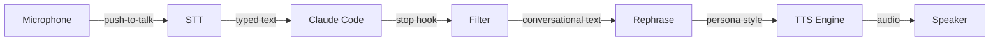

# I Got Tired of Reading Claude's Output, So I Made It Talk Back — in a Pirate Voice

I spend a lot of time in the terminal. Claude Code is my copilot. And after months of squinting at walls of text at 2 AM, I had a thought:

*What if Claude just... told me what it did?*

So I built **Claudible** — a voice interface for Claude Code that speaks every response out loud, using a locally-running neural TTS engine with voice cloning. And because I apparently can't leave anything alone, I added an AI rephrasing layer so Claude can deliver its answers as a 1940s film noir detective, a NASA mission controller, or yes — a pirate.

## What It Actually Does

Claudible sits between Claude Code and your speakers. Every time Claude finishes a response, a hook fires, the output gets filtered down to just the conversational parts (no one wants to hear a 200-line diff read aloud), optionally rephrased through a local LLM, and then spoken through Coqui XTTS v2 — a neural text-to-speech model running on your GPU.

It also does speech-to-text. Hold Right Ctrl, speak, and your words get typed directly into the terminal via nerd-dictation and VOSK. Full hands-free Claude Code, minus the mass surveillance.

Everything runs locally. No cloud APIs. No data leaving your machine. Just your GPU doing honest work.

## The Fun Part: Personas

Here's where it gets good. Claudible has a rephrasing layer powered by Ollama that transforms Claude's output before it hits the speaker. You pick a persona, and suddenly your coding assistant has *character*.

**Mission Control** turns your terminal into Houston:

> *"Roger that. Telemetry confirms the build is nominal. All systems are go for deployment."*

**Noir** makes every bug feel like a Raymond Chandler novel:

> *"The function walked into the runtime like it owned the place. It didn't. Three null references and a type error — this case was getting ugly."*

**Pirate** is exactly what you think it is:

> *"Arr, the tests be passing, matey! Smooth sailing ahead. No barnacles on this hull."*

**Drill Sergeant** keeps you accountable:

> *"Listen up, recruit! That build failed and I want answers! Fix that code and get it passing — that's an order!"*

**Butler** is understated British perfection:

> *"If I may observe, sir, the deployment has concluded without incident. Very good."*

There are 12 built-in personas, and you can create your own — just drop a text file with a system prompt into `~/.config/claudible/personas/` and you're done.

## Voice Cloning from a 10-Second Sample

XTTS v2 can clone any voice from a short audio sample. Record yourself, grab a clip from a public domain source, or combine a few short samples:

```bash
# Record your own voice
claudible voices record my-voice

# Or combine short clips into an XTTS-ready sample
claudible voices combine hal clip1.wav clip2.wav clip3.wav

# Test it
claudible voices test hal
```

The model runs entirely on your GPU — an NVIDIA card with 4+ GB VRAM is all you need. On an RTX 3060 or better, speech generation is faster than real-time.

## How It Fits Together



The filter is the unsung hero. It strips code blocks, command output, file paths, markdown tables, and git hashes — so you only hear the parts that matter. The rephrasing is optional (off by default) and uses whatever Ollama model you prefer.

## Three Commands to Get Started

```bash
# Install (uv downloads Python 3.11 automatically)
uv tool install claudible --python 3.11

# Interactive setup — installs deps, configures voice, starts daemon
claudible install

# Install the Claude Code hook
claudible hooks install
```

That's it. Next time Claude responds, you'll hear it.

The daemon runs as a systemd user service, starts on login, and puts a tray icon in your system tray for quick mute/unmute. Or run it interactively with `claudible run` if you prefer.

## The Stack

- **TTS**: Coqui XTTS v2 on a local FastAPI server (localhost:5959)
- **STT**: nerd-dictation + VOSK (offline speech recognition)
- **Rephrase**: Ollama (any local LLM — llama3.2:3b works great)
- **Integration**: Claude Code stop hooks (stdin JSON → filter → rephrase → speak)
- **Platform**: Linux, NVIDIA GPU, Python 3.11

## Try It

The repo is at [github.com/JayTitus/claudible](https://github.com/JayTitus/claudible). MIT licensed. PRs welcome.

If you've ever wanted your AI coding assistant to sound like a pirate captain narrating your git commits, this is the project for you. And if that's never occurred to you — well, now it has. You're welcome.
